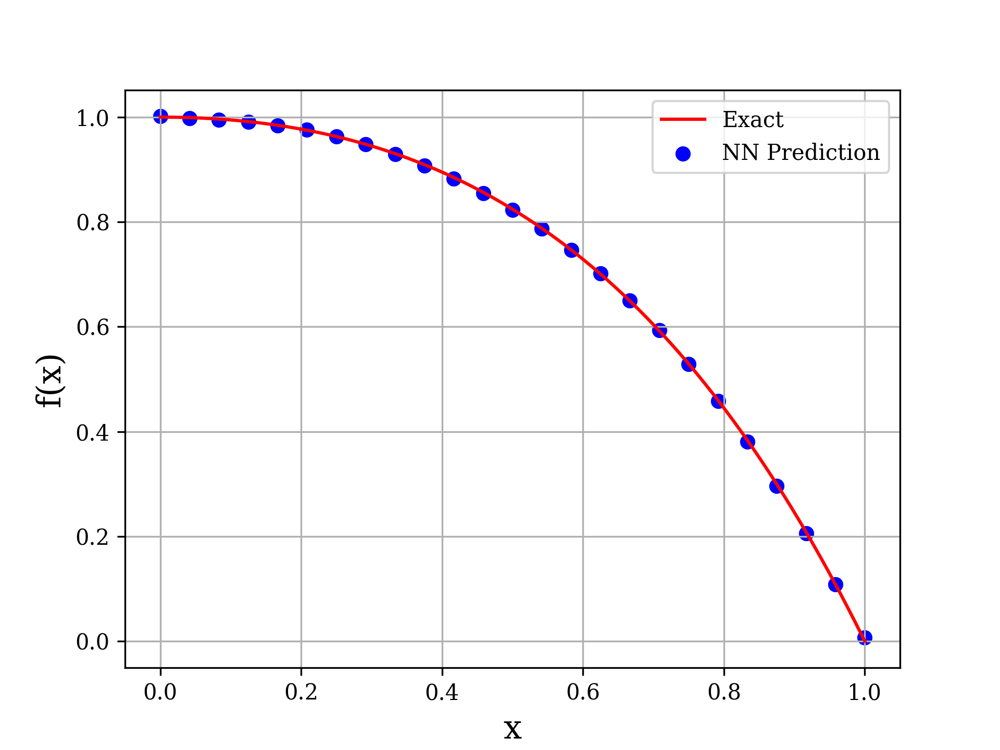

[](https://python.org)
[](https://www.tensorflow.org)

# ODEN6 – 6th Order ODE Solver
<p align="center">
  
</p>

| &nbsp;        | &nbsp;           |
| ------------- |:-------------:|
|**NN ODEsolver:**  | Code that numerically solves ODEs using Neural Networks in an unsupervised manner|
| **Author:**  | Pavithra Venkatachalapathy |

## 🧠 Motivation
Feedforward neural networks can approximate any continuous function to arbitrary accuracy — a loose statement of the Universal Approximation Theorem. Unlike traditional solvers, this network trains to satisfy the differential equation and boundary/initial conditions simultaneously, without needing the true solution. The loss is approximately the mean absolute error.

Original paper: [Neural Network Solvers for ODEs](https://arxiv.org/abs/2005.14090)

This fork extends the ODEN framework to solve a **6th-order differential equation**, which was not included in the original paper.

---

## 🔍 Overview

This project solves the following 6th-order ODE:


\[
y^{(6)}(x) = -6 e^x + y(x)
\]


The residual is defined as:

```python
self.eqf = d6ydx6 + 6.0 * tf.exp(x) - y

#⚙️ Installation
    git clone <your-repo-url>
    cd <your-repo-folder>
    pip install -r requirements.txt

#📁 Project Structure
.
├── dictionary.py       # Contains initializers, activations, optimizers
├── diffeq.py           # Defines differential equations (6th order supported)
├── odesolver.py        # Neural network solver class
├── main.py             # Script to run examples
├── requirements.txt
├── results/            # Folder for plots, animations, and CSV outputs

#🧪 Usage
 ODEsolver(order, diffeq, x, initial_condition, epochs, architecture, initializer, activation, optimizer, prediction_save, weights_save)

🧩 Key Modules
dictionary.py
Contains mappings for initializers, activations, and optimizers.
from dictionary import Dictionary
D = Dictionary()
Dict = D.Dict

diffeq.py
Defines the differential equation residuals.
from diffeq import DiffEq

Example for 6th-order:
if diffeq == "sixth":
    self.eqf = d6ydx6 + 6.0 * tf.exp(x) - y

📊 Outputs
Saved in results/:

solution_plot.png: Predicted vs. true solution

loss_curve.png: Training loss over time

training_animation.gif: Animated training progress

output_values.csv: CSV of predicted values

📌 Notes
TensorFlow 2.x compatible

Easily extendable to other high-order equations

Training is unsupervised — no ground truth needed